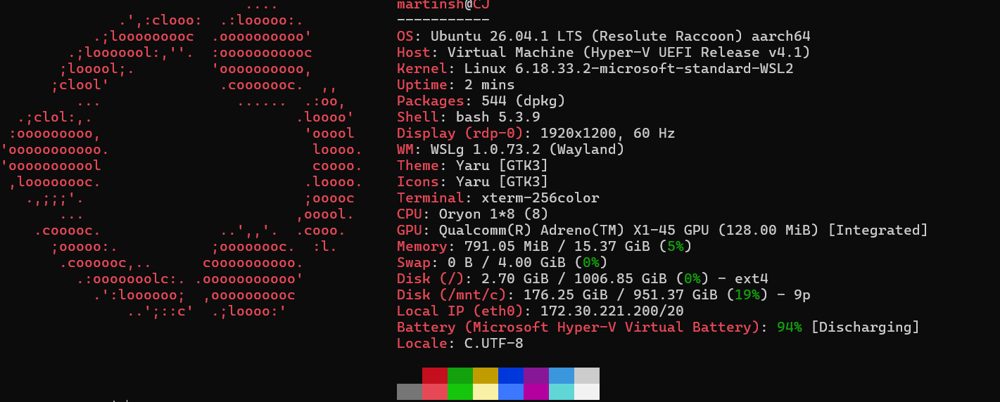

# Week 36 OCI Cloud Security Lab
## 1. Min OCI-miljö/Min lokala Linux-miljö/Min lokala WSL-miljö

 
  
  
  
  
- VM-namn/hostnamn/WSL-maskinnamn: martinsh
- Operativsystem: Ubuntu 26.04.01 
- Inloggningsmetod: SSH 
---
## 2. Linux-kommandon
| Kommando | Vad visar det? | CIA-koppling |
|-----------|-----------|-----------|
| whoami | Visar vilken adress som är inloggad | Konfidentialitet och integritet|
| hostname | Visar datorns eller serverns namn | Integritet |
| pwd | Visar aktuell arbetskatalog |Integritet |
| uname -a | Visar arkitektur, OS och kernel| Tillgänglighet |
| uptime |Visar hur länge systemet varit igång | Tillgänglighet |
---
## 3. Hardening
| Kontroll | Risk | Vad gjorde jag? | Hur verifierade jag? | CIA |
|--------|-------|-----------|-----------|-----------|
|ID och behörighet| En användare kan ha större rättigheter än nödvändigt|Jag körde kommando "whoami", "id" och "groups". Användaren var "martinsh" och tillhörde "martinsh adm cdrom sudo dip plugdev users"  |Jämförde användarens grupper med rättigheterna, administrativa kommandon kördes bara med "sudo". | Konfidentialitet och integritet|

   Hardening
| Kontroll | Risk | Vad gjorde jag? | Hur verifierade jag? | CIA |
|-----------|-----------|-----------|-----------|-----------|
| Sytemuppdateringar|brister kan finnas installerade i paketet|kommandot "sudo apt update" sedan "apt list --upgradable" | Resultatet visade att ett paket kunde upgraderas, sedan installerade jag uppdateringen| Integritet,tillgänglighet och konfidentialitet|

   Hardening
| Kontroll | Risk | Vad gjorde jag? | Hur verifierade jag? | CIA |
|-----------|-----------|-----------|-----------|-----------|
|Loggar|Händelser och fel kan missas utan en loggkontroll | kommandot "ls/var/log"| Jag såg många loggar | Integritet och tillgänglighet. |

 Hardening
| Kontroll | Risk | Vad gjorde jag? | Hur verifierade jag? | CIA |
|-----------|-----------|-----------|-----------|-----------|
| SSH|felaktig ssh eller borttappad nyckel kan hindra åtkomst | jag anslöt med ssh| verifierade inloggningen med "whoami","hostname" och sedan "uptime"|Konfidentialitet, tillgänglighet och integritet.  |

---
## 4. Recovery-plan
### Vad kan gå fel?

Fel som kan hända är att WSL2 fungerar inte som väntat, att inte kunna ha internet.

### Hur upptäcker jag problemet?

Jag får fel meddelande såsom "connect to host X.X.X.X port 22: network in unreachable" trots att servern är på. 

### Vad kontrollerar jag först?

Det första man ska göra är att kolla ifall DNS fungerar, om det bara gäller WSL eller windows också och ifall windows brandvägg blockerar WSL.

### Hur återställer jag åtkomst?

Jag börjar med att starta om WSL nätverket "wsl --shutdown" eller att starta om windows nätverk. eller att WSL kanske bara behhövde uppdateras till senaste versionen. 

### När behöver jag hjälp?

ifall allt jag gjort inte fungerar så ber jag läraren om hjälp genom en annan enhet. 

---
## 5. Backup
### Vad har jag sparat?

Allt jag har dokumenterat i VS code finns  i Github under namnet "docs/week36-oci-cloud-security.md"

wsl --export ubuntu week36backup.tar

### Vad finns i GitHub?

Allt ovan och allt denna fil innehåller 

### Vad kan återskapas?

wsl --import ubuntu C:\WSL\ubuntu C:\backup\week36backup.tar

Miljön, kommandon och kontroller. 

### Vad går inte att återskapa?

Det jag inte kan återskapa är det som inte har säkerhetskopierats. 
---
## 6. Cleanup
### VM-instans
Behålls enligt läraren
### Diskar
Behålls enligt läraren
### Backuper
Behålls enligt läraren
### Publika IP-adresser
Behålls enligt läraren
### GitHub-evidens
Behålls enligt läraren. Finns på rätt plats https://github.com/Martincj98/Martin-Shamoon-ITSX26-labb01.git
---
## 7. CIA-reflektion
### Konfidentialitet
Skyddade det genom att inte publicera privata nycklar och rättigheter.
### Integritet
Jag kontrollerade användare och uppdateringar.
### Tillgänglighet
Kontrollerade SSH och kontrollerade uptime. 
---
## 8. Reflektion
### Vad fungerade bra?
Hjälpen jag fick av mina klasskamrater 
### Vad var svårt?
Hela uppgiften, eftersom jag inte har någon erfarenhet av detta tidigare.
### Vad lärde jag mig?
Mycket mer än vad jag trodde. Hur man navigerar sig i olika program. Vad kommandon är. 